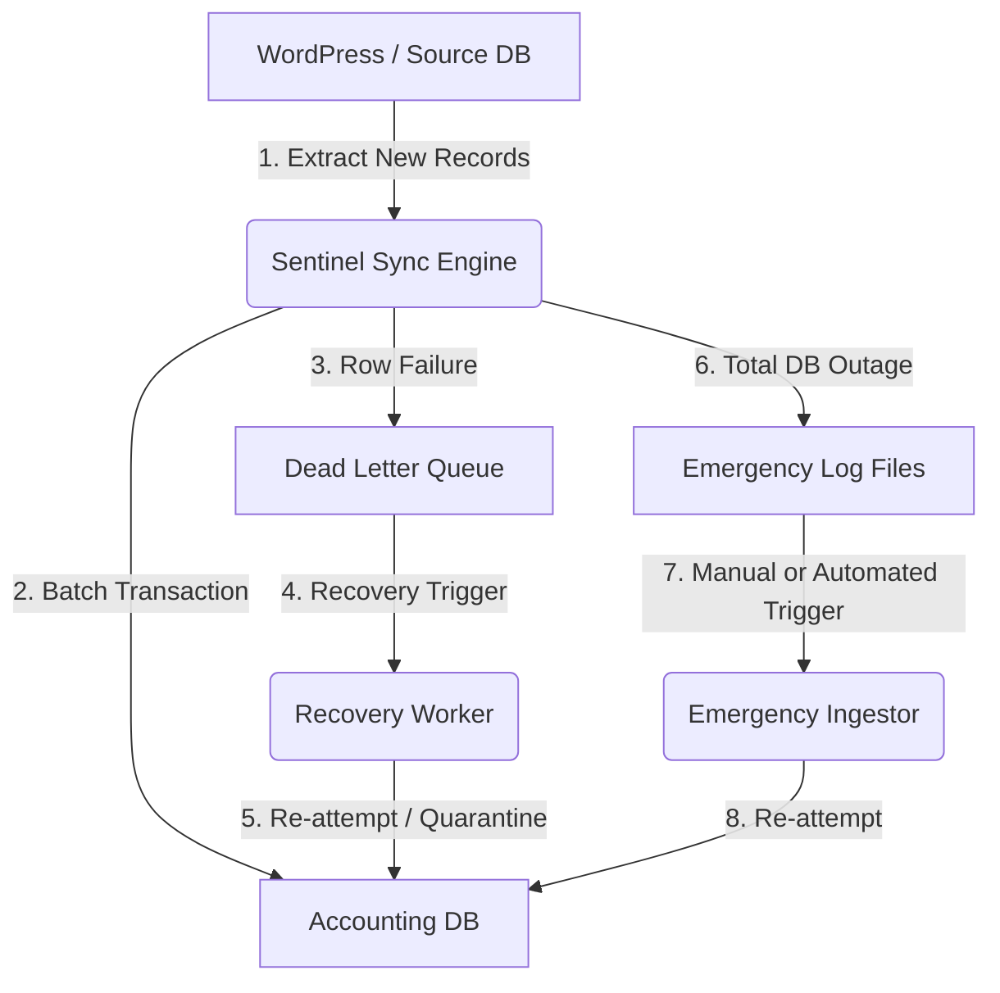

# Sentinel Sync Engine
**A Fault-Tolerant, Idempotent Data Pipeline for Mission-Critical Systems**

[](https://github.com/Hawsome)
[](https://opensource.org/licenses/MIT)
[](https://github.com/Hawsome)
[](https://github.com/Hawsome/sentinel-sync-engine/actions/workflows/php-check.yml)

## The Problem
In high-stakes environments, particularly for nonprofits and mission-driven organisations, data loss is not an option. Standard synchronisation scripts often fail due to:
*   **Network Timeouts:** External API or database connectivity drops.
*   **Server Crashes:** Resource exhaustion during large data migrations.
*   **Data Duplication:** Retrying a failed sync often results in "double-counting" records.

**Sentinel is built for when things break.**

## The Solution
Sentinel is a PHP-based synchronisation engine designed with a **"Failure-First"** mentality. It moves data from a Source (CMS) to a Destination (Relational DB) while ensuring:
1.  **Zero Data Loss:** Implements a **Dead Letter Queue (DLQ)** to serialise and capture failed syncs for later recovery.
2.  **Idempotency & State Tracking:** Uses a persistent `sync_cursor` table to track the last successfully synced ID, and unique constraints to ensure retrying a sync never results in duplicate data.
3.  **Self-Healing:** A dedicated **Recovery Worker** that monitors the DLQ and re-processes items once the system is back online, with automatic quarantine after repeated failures.
4.  **Concurrency Safety:** `flock`-based process locking prevents overlapping cron jobs. The OS automatically releases the lock if a process dies.

## Architecture Flow


## Three-Tier Resilience Model

| Tier | Trigger | Mechanism |
|------|---------|-----------|
| **1 - Primary Sync** | Normal operation | Stream rows from source → batch-insert to destination |
| **2 - Dead Letter Queue** | Row-level insert failure | Serialise failed payload as JSON into `sync_dead_letter_queue` on source DB |
| **3 - Emergency Log** | Source DB also unreachable | Append payload to a local JSON log file for later ingestion |

## Key Engineering Features
*   **Financial Precision:** Stores currency as integers (kobos) in source/transit to avoid floating-point rounding errors, only converting to `DECIMAL(10,2)` at the final destination.
*   **Resilience Pattern:** Uses a `try-catch-queue` loop. A single record failure does not crash the entire migration process.
*   **Data Validation:** Every row is validated (positive integer amount, RFC 5321 email format) before any database write.
*   **Data Normalisation:** Maps unstructured/messy CMS metadata into a strict, indexed relational schema optimised for BI and reporting.
*   **Memory Management:** Processes records via streaming (`PDO::fetch()`) and batches inserts in 500-row transactions to prevent PHP memory exhaustion.
*   **Security:** PDO prepared statements eliminate SQL injection. Explicit column selects (`id, donor_email, amount_kobo`) prevent future source-schema columns from leaking into the destination or DLQ payloads. Credentials are required via `.env` — there are no hardcoded fallback values.
*   **Audit Trail:** Every sync run writes a row to `sync_audit_log` recording row counts, failure counts, run duration, and final cursor position.
*   **Structured Logging:** All output includes timestamps and log levels (`INFO`, `WARN`, `ERROR`, `CRITICAL`), making it safe to capture in cron and ship to log aggregators.

## Technical Decisions
*   **Why a `sync_cursor` table instead of `MAX(remote_id)`?** A cursor stored explicitly in the destination is safe under all conditions — gaps in source IDs, multi-writer scenarios, or out-of-order inserts. `MAX(remote_id)` can silently skip rows if the source has non-sequential IDs.
*   **Why JSON for the DLQ?** Storing failed payloads as JSON decouples the recovery process from the source schema. If the source table changes, the Recovery Worker still has the original data snapshot as it existed at the time of failure.
*   **Why `flock` instead of `file_exists` + `file_put_contents`?** The `file_exists` check followed by a write is a classic TOCTOU race condition — two processes can both pass the check before either writes. `flock(LOCK_EX | LOCK_NB)` is atomic and the OS releases the lock automatically if the process dies, eliminating the need for stale-lock heuristics.
*   **Why quarantine in the Recovery Worker?** Records that fail repeatedly (e.g. due to corrupt data or a schema mismatch) are quarantined after `MAX_ATTEMPTS` (5) rather than retried forever. This prevents a small batch of broken records from hammering the destination indefinitely.
*   **Why PHP/PDO?** PDO (PHP Data Objects) ensures the engine is database-agnostic. The logic can be ported from MySQL to PostgreSQL or SQLite with minimal configuration changes.

## Getting Started

### Prerequisites
*   PHP >= 8.1
*   MySQL (two databases: source and destination)
*   Composer

### 1. Database Setup
Run the SQL scripts provided in the `/sql` directory:
```bash
mysql -u your_db_user -p < sql/source_setup.sql
mysql -u your_db_user -p < sql/destination_setup.sql
```

### 2. Install Dependencies
```bash
composer install
```

### 3. Configuration
Copy the example environment file and fill in your credentials:
```bash
cp .env.example .env
```
```ini
DB_HOST=127.0.0.1
DB_PORT=3306
DB_USER=your_db_user
DB_PASS=your_db_password
DB_SOURCE=wp_source_db
DB_DEST=accounting_dest_db
```
`DB_PORT` is optional and defaults to `3306` if not set. All other five variables are required. The engine will throw a clear error at startup if any are missing.

### 4. Execution
Run the primary sync engine:
```bash
php src/SyncEngine.php
```
Run the recovery worker to drain the Dead Letter Queue:
```bash
php src/RecoveryWorker.php
```
Run the emergency ingestor to process any filesystem fallback logs:
```bash
php src/EmergencyIngestor.php
```

### Suggested Crontab
```cron
# Run sync every 5 minutes, capture output to a log file
*/5 * * * * /usr/bin/php /path/to/src/SyncEngine.php >> /var/log/sentinel/sync.log 2>&1

# Run recovery worker every 15 minutes
*/15 * * * * /usr/bin/php /path/to/src/RecoveryWorker.php >> /var/log/sentinel/recovery.log 2>&1

# Check for emergency logs every 10 minutes
*/10 * * * * /usr/bin/php /path/to/src/EmergencyIngestor.php >> /var/log/sentinel/emergency.log 2>&1
```

## Future Roadmap
- [ ] Implement a **Circuit Breaker** to stop the engine automatically if the failure rate exceeds 20%.
- [ ] Add **Slack/Email Notifications** for DLQ alerts and quarantine events.
- [ ] Develop a Web UI to monitor sync health, cursor position, and audit log in real-time.
- [ ] Add static analysis to CI (PHPStan or Psalm) alongside the existing syntax check.
