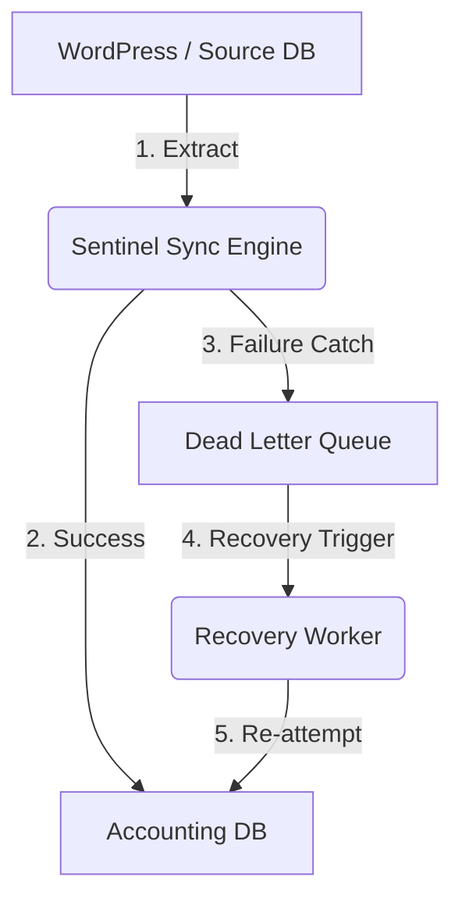

# Sentinel Sync Engine
**A Fault-Tolerant, Idempotent Data Pipeline for Mission-Critical Systems**

[](https://github.com/hawesome)
[](https://opensource.org/licenses/MIT)
[](https://github.com/hawesome)

## The Problem
In high-stakes environments, particularly for nonprofits and mission-driven organizations, data loss is not an option. Standard synchronization scripts often fail due to:
*   **Network Timeouts:** External API or database connectivity drops.
*   **Server Crashes:** Resource exhaustion during large data migrations.
*   **Data Duplication:** Retrying a failed sync often results in "double-counting" records.

**Sentinel is built for when things break.**

## The Solution
Sentinel is a PHP-based synchronization engine designed with a **"Failure-First"** mentality. It moves data from a Source (CMS) to a Destination (Relational DB) while ensuring:
1.  **Zero Data Loss:** Implements a **Dead Letter Queue (DLQ)** to serialize and capture failed syncs for later recovery.
2.  **Idempotency:** Utilizes unique constraints to ensure that retrying a sync never results in duplicate data.
3.  **Self-Healing:** A dedicated **Recovery Worker** that monitors the DLQ and re-processes items once the system is back online.

## Architecture Flow


## Key Engineering Features
*   **Financial Precision:** Stores currency as integers (kobos) in source/transit to avoid floating-point rounding errors, only converting to `DECIMAL(10,2)` at the final destination.
*   **Resilience Pattern:** Uses a `try-catch-queue` loop. A single record failure does not crash the entire migration process.
*   **Data Normalization:** Maps unstructured/messy CMS meta-data into a strict, indexed Relational SQL schema optimized for BI and Reporting.
*   **Security:** Full implementation of **PDO Prepared Statements** to eliminate SQL Injection risks.

## Technical Decisions: Why I built it this way
*   **Why JSON for the DLQ?** By storing failed payloads as JSON, I decoupled the recovery process from the source schema. If the source table changes, the Recovery Worker still has the original data "snapshot" as it existed at the time of failure.
*   **Why Idempotency?** Using `ON DUPLICATE KEY UPDATE` ensures that the system is "stateless." If the sync job is interrupted and restarted, it gracefully updates existing records rather than creating duplicates.
*   **Why PHP/PDO?** I chose PDO (PHP Data Objects) to ensure the engine is database-agnostic. The logic can be ported from MySQL to PostgreSQL or SQLite with minimal configuration changes.

## Getting Started

### 1. Database Setup
Run the SQL scripts provided in the `/sql` directory:
```bash
mysql -u root -p < sql/source_setup.sql
mysql -u root -p < sql/destination_setup.sql
```

### 2. Configuration
Update the connection constants in `src/config.php`:
```php
$host = '127.0.0.1';
$port = '10016';
$user = 'root';
$pass = 'root';
```

### 3. Execution
To run the primary sync engine:
```bash
php src/SyncEngine.php
```
To run the recovery worker (clears the queue):
```bash
php src/RecoveryWorker.php
```

## Future Roadmap
- [ ] Implement a **Circuit Breaker** to stop the engine automatically if the failure rate exceeds 20%.
- [ ] Add **Slack/Email Notifications** for critical DLQ alerts.
- [ ] Develop a Web UI to monitor sync health in real-time.